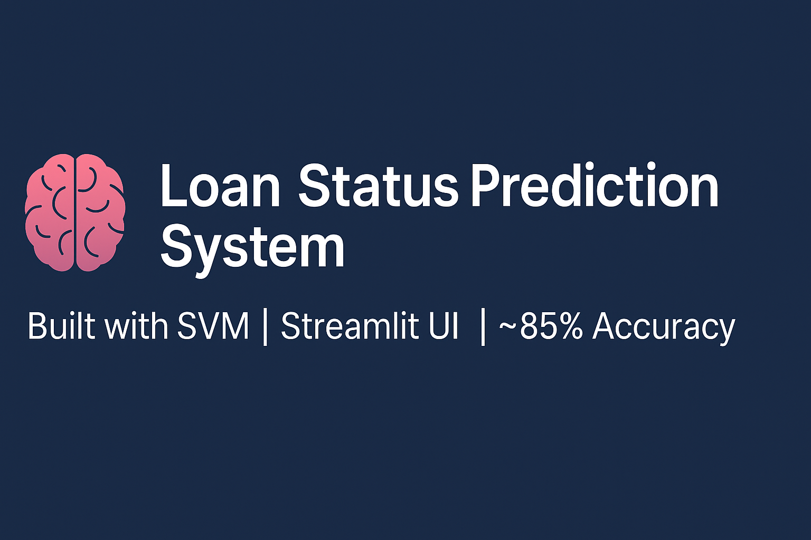

🧠 Loan Status Prediction System
This project predicts whether a loan will be approved based on applicant details using a Support Vector Machine (SVM) model. The goal is to automate loan decision-making with high accuracy.

🔗 Live App: [Click here to try it out]👉(https://loan-status-prediction-system.streamlit.app/)

🚀 Features

Predicts loan approval using SVM
~85% accuracy on test data
Clean data preprocessing pipeline
Confusion matrix and accuracy score output
Interactive UI using Streamlit

📌 Problem Statement

Manual review of loan applications is slow and prone to human error. This ML-based system helps financial institutions automate decisions efficiently by predicting outcomes based on applicant data.

🛠️ Technologies Used

Language: Python
Libraries: Pandas, NumPy, Scikit-learn
Model: Support Vector Machine (SVM)
Web Interface: Streamlit

📁 Project Structure

loan-status-prediction/
│
├── data/ # Folder containing the dataset
│ └── train.csv # CSV file used for training the ML model
│
├── loan_prediction.py # ML model training, preprocessing, and evaluation script
│
├── app.py # Streamlit web application for user interface
│
├── requirements.txt # List of Python packages needed to run the project
│
├── README.md # Project overview and instructions
│
├── banner.png # GitHub banner image for the README
│
├── .gitignore # Files and folders to exclude from Git tracking

⚙️ How to Run the Project Locally

1️⃣ Clone the repository
git clone https://github.com/Kartheek811/loan-status-prediction.git cd loan-status-prediction

2️⃣ Install dependencies

pip install -r requirements.txt

3️⃣ Launch the web app

streamlit run app.py

📈 Model Performance Accuracy: ~85%

Algorithm: Linear SVM

Preprocessing: Label encoding, handling missing values

👨‍💻 Author Tungana Kartheek 📧 kartheektungana@gmail.com 📍 Srikakulam, Andhra Pradesh 🔗 https://github.com/Kartheek811
